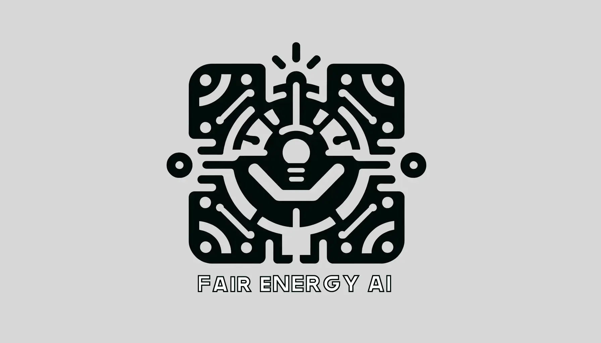

# Fair Energy AI



## Introduction

The Fair Energy AI is an demonstration on how AI models and software relying on them can be transparent and deliver fair results in Energy Management sector.

## Features

- Comprehensive backend and frontend development modules tailored for web applications.
- A user-friendly interface for energy consumtion overview.

## Getting Started

### Tech-Stack

#### General

- [Git](https://git-scm.com) [Version Control]
- [Docker](https://www.docker.com/get-started) [Containerization]
- [GitHub](https://github.com/) [Code Hosting]
- [GitHub Actions](https://github.com/features/actions) [CI/CD]

#### Frontend

- [Typescript](https://www.typescriptlang.org/) [Programming Language]
- [NodeJs](https://nodejs.org) [Javascript runtime]
- [SvelteKit](https://kit.svelte.dev/) [Full-Stack Framework]
- [Svelte](https://svelte.dev/) [Frontend Framework]
- [TailwindCSS](https://tailwindcss.com/) [CSS Framework]
- [DaisyUI](https://daisyui.com/) [Tailwind Component Library]

### Prerequisites

- [Git](https://git-scm.com/downloads)
- [Docker](https://www.docker.com/get-started)
- [NPM](https://www.npmjs.com/)
- [Nodejs](https://nodejs.org)

---

### Installation

#### Clone

```bash
https://github.com/kamyabnazari/fair-energy-ai.git
```

#### Setup

##### Running the project

```bash
npm install

npm run dev
```

##### Building the project

To create a production version of your app:

```bash
npm run build
```

You can preview the production build with `npm run preview`.

---

### License

This project is licensed under the [Apache-2.0 license] License - see the LICENSE file for details.

---

### Acknowledgments

Special thanks to my project team for the details.

Logo design assisted by OpenAI's ChatGPT and DALL-E, AI-powered tools for text and image generation.
